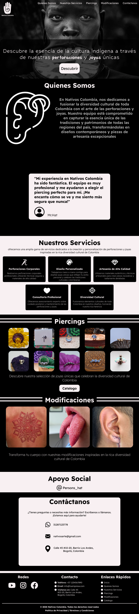
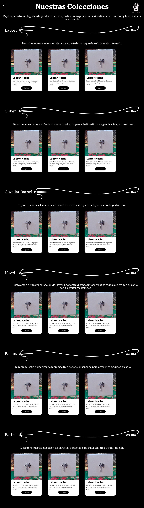
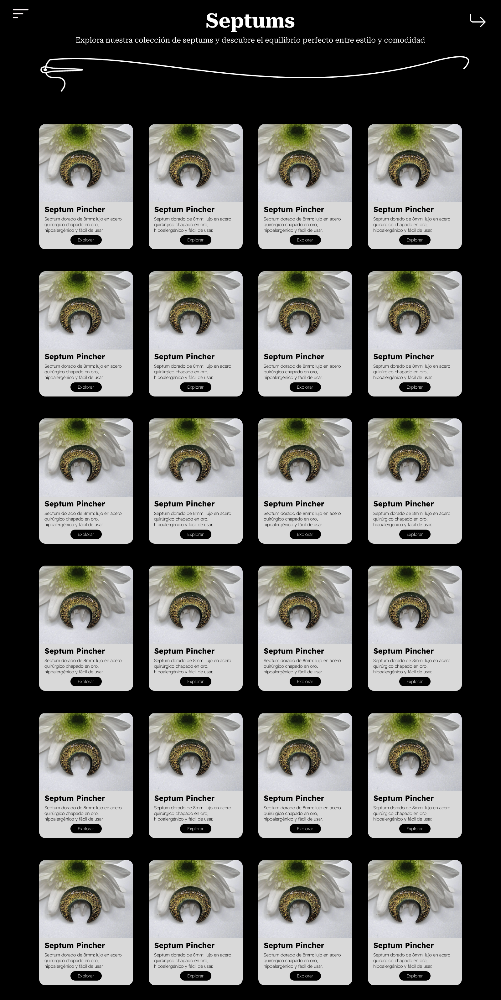
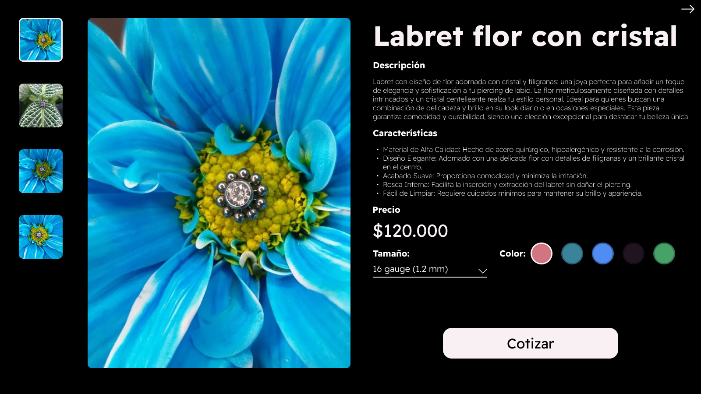

# Web-Nativos
Nativos Colombia es un proyecto que se enfoca en el diseño de una web estilo eCommerce para promocionar joyas estéticas y modificaciones corporales. La web está concebida para resaltar la belleza y la cultura colombiana, ofreciendo a los clientes una experiencia de compra única y personalizada.

**Este proyecto tiene como objetivo crear una plataforma que no solo exhiba joyas artesanales de alta calidad, sino que también brinde información sobre modificaciones corporales, incluyendo piercings y otros servicios. La combinación de estos elementos busca atraer tanto a locales como a turistas interesados en la estética y el arte del cuerpo, reflejando la diversidad cultural y la creatividad de Colombia**

# Pagina Principal

# Catalogo

# Catalgo Variado

# Producto

# Copy

**Todas las imagenes y partes de la marca Nativos Colombia son unicamente de esta por lo que no se permite la distribucion de este contenido sin permiso del dueño y patente de la marca Nativos: [Nativos Colombia](https://www.instagram.com/nativoscolombia/?hl=es)**

**Todos los derechos de autor reservados para @Nativos Colombia**
